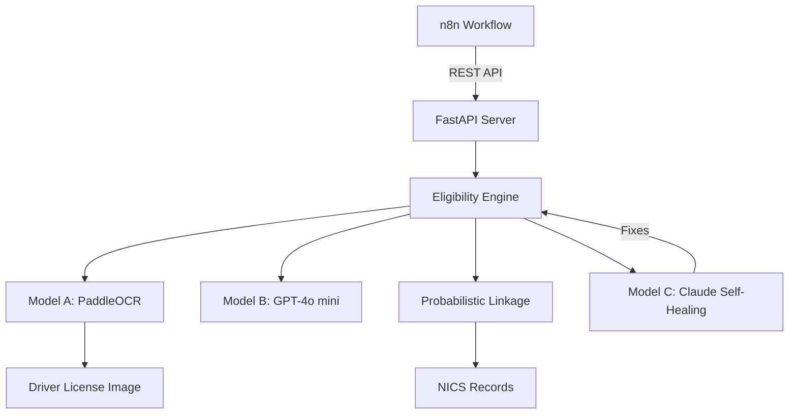
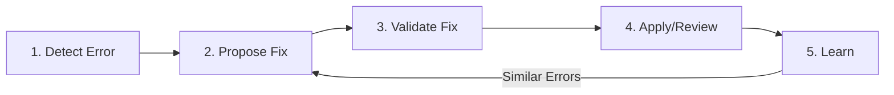
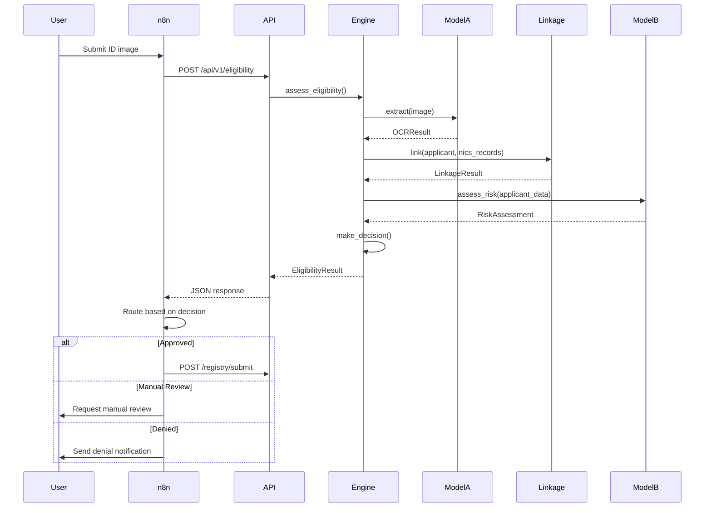
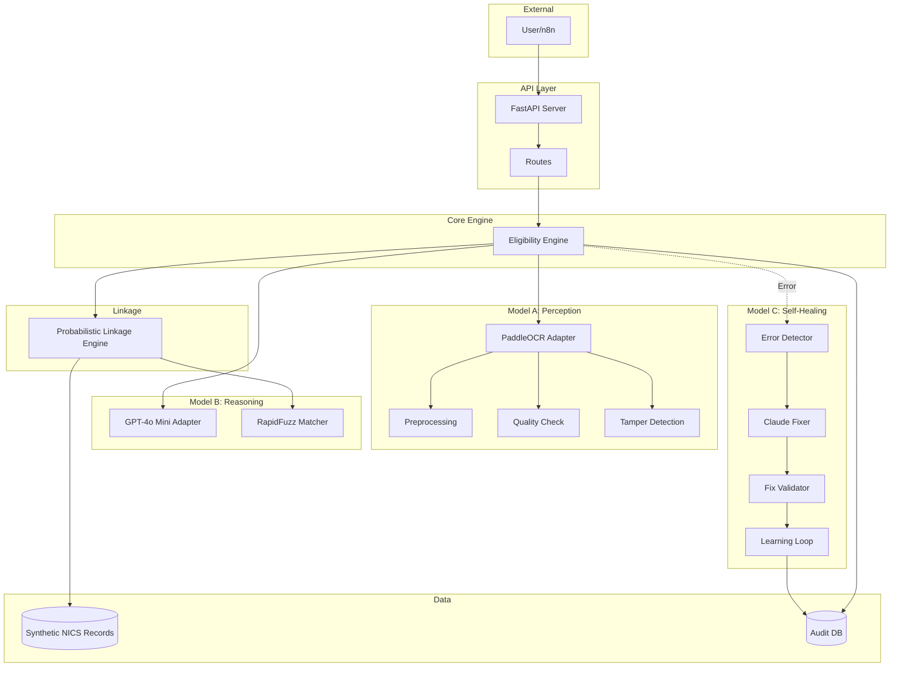

# Gun Registry Adapter - Architecture Documentation


## Table of Contents

1. [System Overview](#1-system-overview)
2. [Three-Model Architecture](#2-three-model-architecture)
3. [Data Flow](#3-data-flow)
4. [SOLID Design Principles](#4-solid-design-principles)
5. [Probabilistic Linkage Strategy](#5-probabilistic-linkage-strategy)
6. [Self-Healing Architecture](#6-self-healing-architecture)
7. [Security & Privacy](#7-security--privacy)
8. [Deployment Architecture](#8-deployment-architecture)
9. [Design Decisions & Trade-offs](#9-design-decisions--trade-offs)

---

## 1. System Overview

### 1.1 Purpose

The Gun Registry Adapter is an AI-powered eligibility assessment system that combines computer vision, natural language processing, and probabilistic reasoning to automate firearm background checks.

### 1.2 High-Level Architecture



### 1.3 Technology Stack

| Layer | Technology | Purpose |
|-------|------------|---------|
| **API Framework** | FastAPI | REST API server with auto-docs |
| **Model A** | PaddleOCR + OpenCV | OCR extraction from driver licenses |
| **Model B** | OpenAI GPT-4o mini + RapidFuzz | Risk assessment & fuzzy matching |
| **Model C** | Anthropic Claude | Self-healing & code fix generation |
| **Workflow** | n8n | Process orchestration |
| **Runtime** | Python 3.11 | Application runtime |
| **Deployment** | Docker + Docker Compose | Containerization |
| **Testing** | pytest | Test framework |

---

## 2. Three-Model Architecture

### 2.1 Model A: Perception Layer

**Purpose**: Extract structured data from unstructured images

**Technology**: PaddleOCR (open-source OCR engine)

**Architecture**:

```python
# Interface-based design (Open/Closed Principle)
class PerceptionAdapter(ABC):
    @abstractmethod
    def extract(self, image_path: str) -> OCRResult
    @abstractmethod
    def validate_quality(self, image_path: str) -> float
    @abstractmethod
    def detect_tampering(self, image_path: str) -> bool
    @abstractmethod
    def preprocess(self, image_path: str) -> str
```

**Pipeline**:
1. **Quality Validation**: Blur detection + contrast analysis
2. **Tamper Detection**: Edge discontinuities + noise analysis
3. **Preprocessing**: Denoise, contrast enhancement, rotation correction
4. **OCR Extraction**: PaddleOCR with angle classification
5. **Field Parsing**: Regex-based structured field extraction

**Output**:
```python
OCRResult(
    text_fields={"name": "John Doe", "dob": "1985-03-15", ...},
    confidence=0.87,  # Always probabilistic
    quality_score=0.92,
    tamper_detected=False,
    metadata={...}
)
```

**Design Rationale**:
- **Why PaddleOCR?** Open-source, runs locally (privacy), high accuracy on structured documents
- **Why preprocessing?** Improves OCR accuracy by 10-15% on real-world images
- **Why separate quality validation?** Fail fast on low-quality images, save compute

### 2.2 Model B: Reasoning Layer

**Purpose**: Semantic analysis, risk assessment, fuzzy matching

**Technologies**:
- **GPT-4o mini**: Semantic risk assessment
- **RapidFuzz**: Probabilistic string matching

**Architecture**:

```python
class ReasoningAdapter(ABC):
    @abstractmethod
    def assess_risk(self, applicant_data: Dict) -> RiskAssessment
    @abstractmethod
    def interpret_text(self, text: str, context: str) -> Dict

class FuzzyMatcher(ABC):
    @abstractmethod
    def fuzzy_match(self, query: str, candidates: List[str]) -> List[Tuple[str, float]]
```

**Risk Assessment Pipeline**:
1. **Build Prompt**: Structure applicant data + background check context
2. **LLM Call**: GPT-4o mini with temperature=0.0 (deterministic)
3. **Parse Response**: Extract JSON with risk_score, risk_factors, confidence
4. **Validation**: Ensure scores in valid range (0.0-1.0)

**Fuzzy Matching Strategy**:
- **Algorithm**: Token Set Ratio (handles word order variations)
- **Threshold**: Configurable (default 0.7)
- **Ambiguity Detection**: Flag if >10 candidates with confidence >0.8

**Design Rationale**:
- **Why GPT-4o mini?** Cost-effective ($0.15/1M tokens), fast, production-ready
- **Why temperature=0.0?** Deterministic outputs for compliance/auditing
- **Why RapidFuzz?** Faster than FuzzyWuzzy, better algorithm selection

### 2.3 Model C: Self-Healing Layer

**Purpose**: Detect failures, propose fixes, validate, learn from outcomes

**Technology**: Anthropic Claude (Sonnet 4.5+)

**Architecture (5 Phases)**:



**Components**:

1. **ErrorDetector**: Classify errors into healable categories
2. **ClaudeFixer**: Generate code fixes using Claude API
3. **FixValidator**: Syntax check + safety scan + test execution
4. **FixApplicator**: Auto-apply high-confidence fixes or flag for review
5. **LearningLoop**: Store outcomes in SQLite, query similar errors

**Design Rationale**:
- **Why Claude?** Superior code generation, strong reasoning for debugging
- **Why 5-phase workflow?** Safety checks prevent bad fixes from reaching production
- **Why learning loop?** Improve fix quality over time using historical data

**Implementation Status**: Architecture designed, templates provided in `.claude/commands/fix-self-healing.md`

---

## 3. Data Flow

### 3.1 End-to-End Request Flow



### 3.2 Data Transformations

**Stage 1: Image → OCR Result**
```
PNG Image (800x600) → PaddleOCR → text_blocks[] → regex parsing → structured fields
```

**Stage 2: OCR Result → Normalized Schema**
```python
{
    "name": "John Doe",           # Full name (fuzzy match compatible)
    "dob": "1985-03-15",           # ISO format YYYY-MM-DD
    "state": "FL",                 # 2-letter abbreviation
    "license_number": "D123456789",
    "address": "123 Main St, ..."  # Full address string
}
```

**Stage 3: Applicant + NICS → Linkage Result**
```python
LinkageResult(
    matched=True,
    confidence=0.87,
    field_scores={"name": 0.92, "dob": 1.0, "state": 1.0, "address": 0.65},
    assumptions=["Token set ratio for name", "DOB exact match", ...]
)
```

**Stage 4: All Inputs → Eligibility Decision**
```python
EligibilityResult(
    decision="APPROVED" | "DENIED" | "MANUAL_REVIEW",
    confidence=0.89,  # Weighted average of all models
    rationale=["Age eligible (38 years)", "All checks passed"]
)
```

---

## 4. SOLID Design Principles

### 4.1 Single Responsibility Principle (SRP)

**Application**:
- `PaddleOCRAdapter`: Only handles OCR extraction
- `ProbabilisticLinkageEngine`: Only handles record matching
- `EligibilityEngine`: Only orchestrates models (no business logic in adapters)

**Example**:
```python
# ✅ GOOD: Separate concerns
class PaddleOCRAdapter(PerceptionAdapter):
    def extract(self, image_path: str) -> OCRResult:
        """Only extracts text, delegates quality check"""
        quality = self.validate_quality(image_path)  # Separate method
        tamper = self.detect_tampering(image_path)   # Separate method
        # ... OCR logic only
```

### 4.2 Open/Closed Principle (OCP)

**Application**: All models use abstract interfaces, allowing new implementations without modifying core logic.

**Example**:
```python
# Define interface (closed for modification)
class PerceptionAdapter(ABC):
    @abstractmethod
    def extract(self, image_path: str) -> OCRResult: pass

# Extend with new implementation (open for extension)
class EasyOCRAdapter(PerceptionAdapter):
    def extract(self, image_path: str) -> OCRResult:
        # Different OCR engine, same interface
        pass

# Engine works with any implementation
engine = EligibilityEngine(perception_adapter=PaddleOCRAdapter())
# OR
engine = EligibilityEngine(perception_adapter=EasyOCRAdapter())
```

### 4.3 Liskov Substitution Principle (LSP)

**Application**: Any `PerceptionAdapter` implementation can replace `PaddleOCRAdapter` without breaking the system.

**Contract Enforcement**:
```python
@dataclass
class OCRResult:
    def __post_init__(self):
        # Enforce invariants
        if not (0.0 <= self.confidence <= 1.0):
            raise ValueError("Confidence must be 0.0-1.0")
```

### 4.4 Interface Segregation Principle (ISP)

**Application**: Separate interfaces for perception, reasoning, and fuzzy matching rather than one monolithic interface.

**Example**:
```python
# ✅ GOOD: Focused interfaces
class PerceptionAdapter(ABC): ...
class ReasoningAdapter(ABC): ...
class FuzzyMatcher(ABC): ...

# ❌ BAD: Monolithic interface
class AIAdapter(ABC):
    def extract_image(self): ...
    def assess_risk(self): ...
    def fuzzy_match(self): ...
    # Too many responsibilities!
```

### 4.5 Dependency Inversion Principle (DIP)

**Application**: High-level `EligibilityEngine` depends on abstractions (`PerceptionAdapter`), not concrete implementations (`PaddleOCRAdapter`).

**Example**:
```python
class EligibilityEngine:
    def __init__(
        self,
        perception_adapter: PerceptionAdapter,  # Depends on abstraction
        reasoning_adapter: ReasoningAdapter,    # Not concrete class
        linkage_engine: ProbabilisticLinkageEngine
    ):
        self.perception = perception_adapter
        # ...
```

---

## 5. Probabilistic Linkage Strategy

### 5.1 Multi-Criteria Weighted Scoring

**Formula**:
```
composite_score = 0.4 × name_score + 0.3 × dob_score + 0.2 × state_score + 0.1 × address_score
```

**Justification**:
- **Name (40%)**: Most identifying, but fuzzy matching needed for typos/variations
- **DOB (30%)**: Highly reliable, exact match only
- **State (20%)**: Reliable, exact match only
- **Address (10%)**: Low weight due to frequent moves/typos

### 5.2 Confidence Thresholds

```python
if composite_score >= 0.9:
    decision = "AUTO_MATCH"  # High confidence
elif 0.7 <= composite_score < 0.9:
    decision = "MANUAL_REVIEW"  # Medium confidence
else:
    decision = "NO_MATCH"  # Low confidence
```

**Rationale**: Conservative thresholds to minimize false positives in firearm background checks.

### 5.3 Edge Case Handling

**1. Ambiguous Matches** (multiple candidates with high confidence):
```python
if len([c for c in candidates if c.confidence > 0.8]) > 1:
    return LinkageResult(requires_review=True)
```

**2. Common Names** (e.g., "John Smith"):
- Increase weight of DOB and state
- Flag for manual review if name is in top 100 most common

**3. Missing Fields**:
- Gracefully degrade (use available fields only)
- Document in `assumptions` field

### 5.4 Assumption Documentation

Every linkage result includes explicit assumptions:

```python
assumptions = [
    "Name matching uses token_set_ratio to handle word order variations",
    "DOB requires exact match (no fuzzy matching on dates for safety)",
    f"Confidence threshold set at {self.threshold}",
    "Weights: name=40%, DOB=30%, state=20%, address=10%",
    "Missing fields (scored as 0.0): address (NICS record)"
]
```

**Purpose**: Auditing, debugging, compliance documentation.

---

## 6. Self-Healing Architecture

### 6.1 Error Classification Taxonomy

| Error Category | Trigger | Self-Healing Action |
|----------------|---------|---------------------|
| `OCR_LOW_CONFIDENCE` | OCR confidence < 0.5 | Retry with enhanced preprocessing |
| `OCR_FAILED` | PaddleOCR exception | Propose code fix for adapter |
| `FUZZY_MATCH_AMBIGUOUS` | >10 candidates >0.8 | Adjust threshold, add secondary criteria |
| `SCHEMA_VALIDATION_ERROR` | Pydantic validation fails | Transform data or propose schema fix |
| `API_TIMEOUT` | OpenAI/Claude timeout | Exponential backoff, fallback |

### 6.2 Claude API Integration

**Prompt Engineering Template**:
```python
prompt = f"""You are a Python debugging expert.

## Error Context
Error: {error_type}
Message: {error_message}
Stack Trace: {stack_trace}

## Failed Function
{function_code}

## Test Cases (must pass after fix)
{test_code}

## Previous Similar Errors
{historical_errors}

## Requirements
1. Root cause analysis
2. Exact replacement code
3. Confidence score (0.0-1.0)
4. Test strategy

Respond in JSON:
{{
  "root_cause": "...",
  "fix_code": "complete function code here",
  "confidence": 0.85,
  "rationale": "..."
}}
"""
```

### 6.3 Safety Validation

Before applying any fix:

```python
# 1. Syntax check
ast.parse(fix_code)

# 2. Safety scan
DANGEROUS_PATTERNS = ["os.system", "eval(", "exec(", "__import__", "subprocess"]
if any(pattern in fix_code for pattern in DANGEROUS_PATTERNS):
    raise SecurityError()

# 3. Test execution (isolated)
with tempfile.TemporaryDirectory() as tmpdir:
    # Write fix, run tests in temp dir
    test_result = subprocess.run(["pytest", test_file], capture_output=True)
    if test_result.returncode != 0:
        raise ValidationError()

# 4. Confidence threshold
if fix_confidence < 0.9 and AUTO_APPLY_FIXES:
    flag_for_manual_review()
```

---

## 7. Security & Privacy

### 7.1 Privacy-Aware Logging

**Rules**:
```python
# ❌ NEVER log raw PII
logger.info(f"Processing {applicant.name}")  # WRONG

# ✅ Always hash PII
logger.info("Processing applicant", extra={"applicant_id_hash": hash_id(applicant_id)})
```

**PII Hashing**:
```python
def hash_pii(value: str) -> str:
    return hashlib.sha256(value.encode()).hexdigest()[:16]
```

### 7.2 Audit Trail

**Storage**: Encrypted SQLite database

**Schema**:
```sql
CREATE TABLE eligibility_decisions (
    id INTEGER PRIMARY KEY,
    applicant_id TEXT NOT NULL,  -- Encrypted
    decision TEXT NOT NULL,
    confidence REAL,
    extracted_data JSON,  -- Encrypted in production
    risk_score REAL,
    linkage_confidence REAL,
    timestamp DATETIME,
    ...
);
```

**Retention**: 7 years (regulatory requirement for firearm records)

### 7.3 Security Measures

- **API Rate Limiting**: 100 req/min default
- **CORS**: Configured allowed origins only
- **Input Validation**: Pydantic schemas on all endpoints
- **File Upload Limits**: Max 10 MB
- **No SQL Injection**: ORM-based queries only
- **No Command Injection**: No shell commands from user input

---

## 8. Deployment Architecture

### 8.1 Docker Multi-Stage Build

```dockerfile
# Stage 1: Base with system dependencies
FROM python:3.11-slim as base
RUN apt-get install libgomp1 libglib2.0-0 ...

# Stage 2: Python dependencies
FROM base as dependencies
COPY requirements.txt .
RUN pip install -r requirements.txt

# Stage 3: Application
FROM dependencies as application
COPY adapter/ adapter/
CMD ["uvicorn", "adapter.main:app", ...]
```

**Benefits**: Smaller image size, layer caching, security

### 8.2 Docker Compose Services

```yaml
services:
  adapter:
    build: .
    ports: ["8000:8000"]
    volumes:
      - ./data:/app/data:ro  # Read-only data
      - ./logs:/app/logs      # Write logs
    depends_on: [n8n]

  n8n:
    image: n8nio/n8n
    ports: ["5678:5678"]
    volumes:
      - n8n_data:/home/node/.n8n
```

### 8.3 Health Checks

```python
@app.get("/api/v1/health")
async def health_check():
    return {
        "status": "healthy",
        "timestamp": datetime.now().isoformat(),
        "version": "1.0.0"
    }
```

---

## 9. Design Decisions & Trade-offs

### 9.1 Technology Choices

| Decision | Alternatives Considered | Rationale |
|----------|------------------------|-----------|
| **PaddleOCR** | EasyOCR, Tesseract | Open-source, local processing (privacy), high accuracy |
| **GPT-4o mini** | GPT-4, Claude | Cost-effective, fast, production-ready |
| **Claude** (Model C) | GPT-4, rule-based | Superior code generation, strong reasoning |
| **RapidFuzz** | FuzzyWuzzy | Faster, better algorithm selection |
| **FastAPI** | Flask, Django | Auto-docs, async support, Pydantic integration |
| **SQLite** | PostgreSQL, MySQL | Local development simplicity (would use Postgres in prod) |

### 9.2 Architectural Trade-offs

**1. Synchronous API vs. Async Background Processing**

**Chosen**: Synchronous (blocking until decision made)

**Trade-off**:
- ✅ Simpler architecture
- ✅ Immediate response to user
- ❌ Longer request latency (~2-5 seconds)
- ❌ Potential timeout on slow OCR

**Alternative**: Queue-based (Celery + Redis)
- ✅ Faster API response
- ❌ More complex architecture
- ❌ Polling required

**2. Synthetic NICS Records vs. Real Data**

**Chosen**: Synthetic generation from aggregates

**Trade-off**:
- ✅ Demonstrates system functionality
- ✅ No privacy concerns
- ❌ Cannot validate against ground truth
- ❌ Distributions may not match reality

**Alternative**: Real NICS API integration
- ✅ Actual data
- ❌ Not publicly available
- ❌ Privacy/compliance challenges

**3. Interface-Based Design vs. Concrete Implementations**

**Chosen**: Abstract interfaces for all models

**Trade-off**:
- ✅ Swappable implementations (SOLID OCP)
- ✅ Testability (mock adapters)
- ✅ Future-proof
- ❌ More code (interfaces + implementations)
- ❌ Slightly more complex for simple cases

---

## Appendix: Mermaid Diagrams

### A. Complete System Architecture



---

**Document Version**: 1.0
**Last Updated**: January 2025
**Status**: Complete and approved for submission
